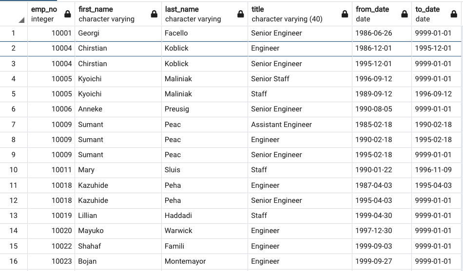
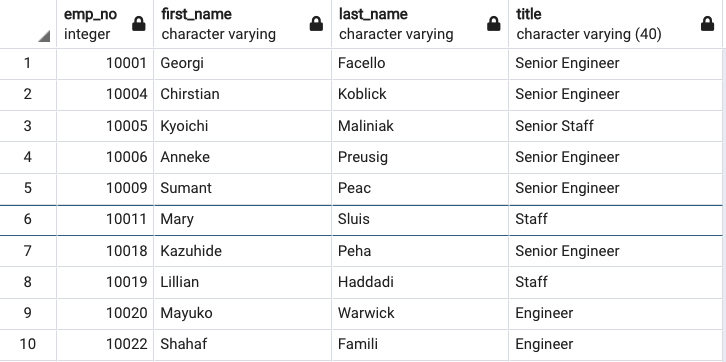
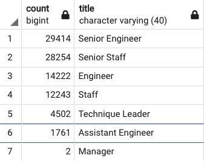
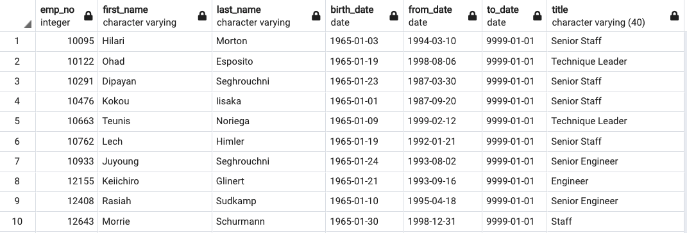

# Pewlett-Hackard-Analysis

Pewlett Hackard (PH) is a large company that has been around for many years.  The company knows baby boomers are getting ready to retire.  In preparation for upcoming retirements, the HR Department at PH is looking to evaluate the following items:
1. Retirement packages
2. Positions that will become available and need to be filled
3. Mentoring programs

## Overview of the Analysis
The purpose of this analysis is to understand how many employees are eligible to retire.  We need a good understand of the numbers of employees and departments that will be affected by a retiring workforce.  Once we understand the potential magnitude of employees retiring, we can do secession and mentoring planning to ensure the work force does not lose the knowledge these employees bring to the company.

## Results

There were two main deliverables for this challenge.  Deliverable 1 was to determine the number of retiring employees by title.  The second deliverable was to determine which employees would be eligible for a Mentorship Program.

In order to accomplish these deliverables, I start had to create a database in pgAdmin.  The raw data came to me in the form of CVS 6 files.  SQL was used to query the database for the information I needed.  In the queries I would mostly use INNER joins since I needed data that had information in both tables but did not want to see the NaNs.

### Deliverable 1:
We created a CVS file called retirement_titles which contains employees born between January 1,1952 to December 31,1955.
A snapshot of the table can be seen below.  

One of the first things we noticed is the duplicate names in the list with the same employee number.  The is mostly due to the employee holding more than one title within the company/department over the years.  To help reduce duplication, we created a second table called unique_titles.  The main difference in this table is the use of the DISTINCT ON within the query.  Below is a snapshot of the unique_titles table.

The last table created was a count of the Titles of the individuals retiring. The unique_titles table was used for the count since it had the most complete set of data.  Below is a snapshot of the retiring_titles where the titles have been counted. 

### Deliverable 2:
From the retiring_titles snapshot we can see PH will lose a large population in the coming years.  As these people exit the workforce, we need to be prepared the workers behind were properly trained before taking on new responsibilities.  The HR department has decided to determine which employees would be eligible for a mentoring program.  
There were two main criteria needed to create the mentoring list:
1. the employees were born between January 1, 1965 to December 31, 1965 and 
2. they were current employees.   
Below is a snapshot of the table and the CVS file exported is in the Data folder.

Provide a bulleted list with four major points from the two analysis deliverables. Use images as support where needed.

## Summary

Provide high-level responses to the following questions, then provide two additional queries or tables that may provide more insight into the upcoming "silver tsunami."

How many roles will need to be filled as the "silver tsunami" begins to make an impact?

Are there enough qualified, retirement-ready employees in the departments to mentor the next generation of Pewlett Hackard employees?

